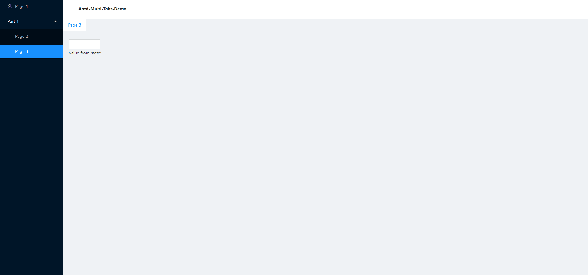

# Antd Multi-tab demo

Use `location` to match the component that needs to be rendered.

- Click tab to switch panels will keep the status of current panel.
- If the panel exists, opening it from the menu will rerender the panel.

### Still have some bugs(already known) here.

- click menu twice will not rerender because it will not trigger the `history.push`.
